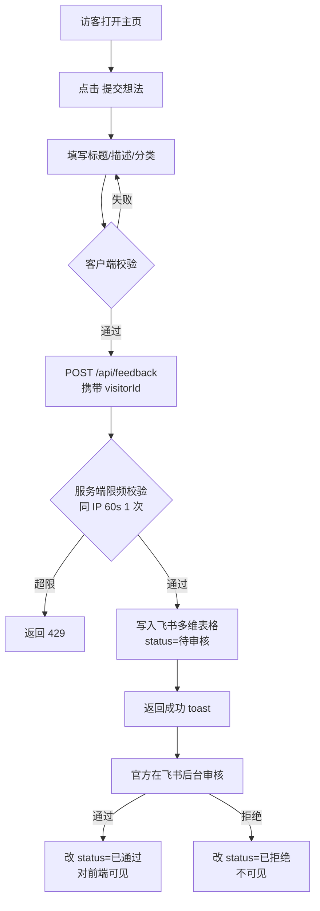
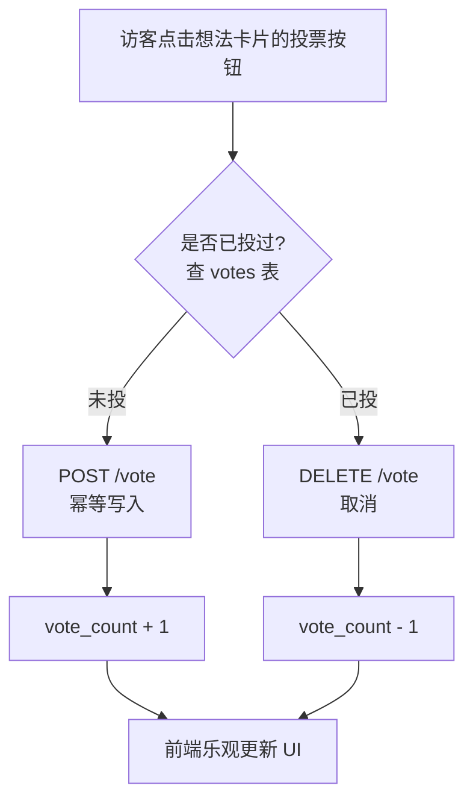
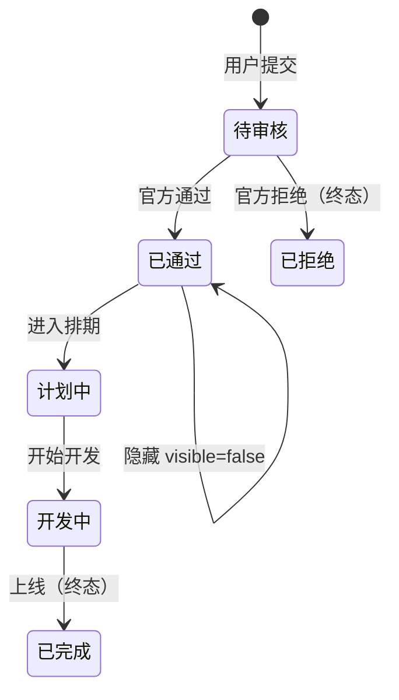

# LuxReal反馈征集平台 · 产品需求文档（PRD）

> 版本：v1.0 · MVP
> 编写日期：2026-04-29
> 适用产品：LuxReal 专业版（LuxReal Pro）官网 · 用户反馈征集模块

---

## 1. 项目背景与目标

### 1.1 背景

LuxReal 专业版网站近期上线，需要一个轻量入口收集真实用户的需求与建议。当前缺乏标准化通道，用户反馈散落在客服、社群、邮件之中，导致：

- 需求池无沉淀，重复需求难识别
- 用户无法看到他人提过同样需求 → 反复提
- 官方决策不透明 → 用户不知道何时采纳
- 没有数据支撑产品迭代优先级

### 1.2 目标

搭建一个 **公开、轻量、免登录** 的需求征集平台：

1. **降低参与门槛**：任何访客无需注册、登录即可提交想法和投票
2. **公开透明**：所有审核通过的想法对所有人可见，按热度/时间排序
3. **决策可视**：通过状态徽章（计划中 / 开发中 / 已完成）让用户看到产品落地进度
4. **官方可控**：运营人员通过飞书多维表格直接审核、改状态、隐藏不当内容

### 1.3 非目标（MVP 不做）

- 用户登录/注册体系
- 评论/讨论区
- 多级标签体系
- 看板视图
- 富文本编辑器（图片/附件上传）
- 多语言

---

## 2. 用户角色与权限

| 角色 | 身份识别 | 权限 |
|------|---------|------|
| 访客（公众用户） | 浏览器指纹（无账号） | 浏览、搜索、过滤、提交想法、投票/取消投票 |
| 官方运营 | 飞书多维表格协作者 | 审核通过/拒绝、修改状态、隐藏/恢复、查看提交者信息 |

> 访客的"身份"由 [FingerprintJS](https://github.com/fingerprintjs/fingerprintjs) 生成的 `visitorId` + 客户端 IP 共同标识，用于：① 防止重复投票 ② 限频防刷。`visitorId` **不**作为账号体系，浏览器清理后会重新生成。

---

## 3. 核心流程

### 3.1 提交想法流程



### 3.2 投票流程



### 3.3 状态机



**前端可见规则**：仅展示 `status ∈ {已通过, 计划中, 开发中, 已完成}` 且 `visible=true` 的项目。

---

## 4. 数据模型（飞书多维表格）

### 4.1 主表 `feedback_items`

| 字段 | 飞书字段类型 | 是否必填 | 说明 |
|------|-------------|---------|------|
| `id` | 自动编号 / 唯一 ID | 自动 | 主键 |
| `title` | 单行文本 | 是 | 标题，≤ 60 字 |
| `content` | 多行文本 | 是 | 描述，≤ 2000 字 |
| `category` | 单选 | 是 | 想法和建议 / Bug 反馈 / 其他 |
| `status` | 单选 | 是 | 待审核 / 已通过 / 计划中 / 开发中 / 已完成 / 已拒绝 |
| `visible` | 复选框 | 是 | 默认 true；false 时前端不展示 |
| `vote_count` | 数字 | 是 | 默认 0；写入投票时通过 API 累加 |
| `submitter_name` | 单行文本 | 否 | 提交者昵称（可选） |
| `submitter_contact` | 单行文本 | 否 | 提交者联系方式（可选，仅官方可见） |
| `submitter_fingerprint` | 单行文本 | 是 | FingerprintJS visitorId（仅服务端写入） |
| `submitter_ip` | 单行文本 | 是 | 客户端 IP（仅服务端写入） |
| `completed_at` | 日期 | 否 | 运营改 `status=已完成` 时手动填；空时不在成就墙展示 |
| `created_at` | 创建时间 | 自动 | 飞书自动维护 |
| `updated_at` | 最后修改时间 | 自动 | 飞书自动维护 |

### 4.2 辅表 `votes`

| 字段 | 类型 | 说明 |
|------|------|------|
| `id` | 自动编号 | 主键 |
| `item_id` | 单行文本 | 关联 `feedback_items.id` |
| `voter_fingerprint` | 单行文本 | 投票者 visitorId |
| `voter_ip` | 单行文本 | 投票者 IP |
| `created_at` | 创建时间 | 自动 |

**业务唯一约束**：`(item_id, voter_fingerprint)` 唯一。由服务端写入前先 SEARCH 校验实现（飞书多维表格无原生唯一索引）。

### 4.3 状态选项颜色映射（前端展示）

| status | 徽章颜色（建议） |
|--------|----------------|
| 已通过 | 灰 / Neutral |
| 计划中 | 蓝 / Blue |
| 开发中 | 黄 / Amber |
| 已完成 | 绿 / Green |

---

## 5. 功能清单

### 5.1 列表页（首页）

- 顶部 Banner：产品介绍 + 主 CTA "提交想法"
- 搜索框：实时按 `title + content` 模糊搜索
- 排序 Tab：
  - **Trending（默认）**：按 `vote_count desc, created_at desc`
  - **Latest**：按 `created_at desc`
- 类别过滤：全部 / 想法和建议 / Bug 反馈 / 其他
- 状态过滤：全部 / 已通过 / 计划中 / 开发中 / 已完成
- 想法卡片（每行一条）：
  - 左侧：投票按钮 + 数字
  - 中间：标题（粗体）+ 描述前 2 行
  - 右侧：状态徽章 + 提交时间
- 分页：每页 20 条；底部 "加载更多" 或翻页器

### 5.2 详情页

- 路径 `/items/[id]`
- 左侧大投票按钮 + 数字（移动端置顶）
- 标题 + 状态徽章 + 类别 + 提交时间
- 完整描述
- 底部 "返回列表"

### 5.3 提交表单（弹窗或独立页）

| 字段 | 类型 | 校验 |
|------|------|------|
| 标题 | input | 必填，1–60 字 |
| 描述 | textarea | 必填，10–2000 字 |
| 类别 | select | 必选 |
| 昵称 | input | 可选，≤ 20 字 |
| 联系方式 | input | 可选，≤ 50 字（邮箱/手机/微信） |

提交按钮：客户端校验通过后调用 API；显示 loading 与成功/失败 toast。

### 5.4 投票交互

- 单击：发起 `POST /api/feedback/[id]/vote`
- 已投状态再次单击：发起 `DELETE`
- 前端乐观更新（先改 UI，请求失败时回滚）
- 投票状态在 `localStorage` 记录一份 `voted_items: string[]`，刷新后保留

### 5.5 已上线成就墙（`/delivered`）

独立路径 `/delivered`，专门展示"被采纳并已上线"的想法，作为社区反馈被听见的证据：

- 顶部 Hero 用 emerald/teal 浅色调（与主页 indigo 区隔），居中展示"感谢社区，已交付 N 个想法"
- 三段式统计行：已上线总数 / 总投票数 / 最近交付距今
- 卡片列表按 `completed_at desc` 倒序，每张卡片包含：标题、描述前 2 行、提交者（如果填了 `submitter_name`）、emerald 徽章「已上线 X 时间前」、票数纯展示（**不可投**，已上线的想法不再接受投票）
- 卡片点击跳转 `/items/[id]` 详情页（复用现有详情页）
- 顶部 Header 增加导航入口"想法广场 / 已上线"，"已上线"右侧带一个绿色计数徽章，实时通过 `/api/stats/delivered` 拉取
- 主列表 `Trending/Latest` **保持原状**，已完成想法仍混在里面，不破坏现有用户习惯
- 仅展示 `status=已完成 && visible=true && completed_at 非空` 的项目；空 `completed_at` 视为脏数据被过滤

---

## 6. 非功能需求

### 6.1 防刷与限频

| 维度 | 限制 |
|------|------|
| 提交想法 | 同 IP 60s 内至多 1 次；同 visitorId 24h 内至多 5 次 |
| 投票 | 同 IP 60s 内至多 10 次；同 (item_id, visitorId) 仅 1 票（业务唯一） |
| 搜索/列表 | 同 IP 1s 内至多 10 次（防爬） |

实现：基于 Upstash Redis 的滑动窗口限频，Key 为 `ratelimit:{action}:{ip}` 与 `ratelimit:{action}:{fp}`。

### 6.2 性能

- 列表页 SSR + ISR 缓存 30s
- 飞书 `tenant_access_token` 内存 + KV 双层缓存（提前 5 分钟刷新）
- 详情页静态生成（`generateStaticParams` + `revalidate=60`）

### 6.3 安全

- 飞书 `app_id / app_secret / app_token` 仅存于 Vercel 环境变量，前端不可见
- 所有写操作必须经 Next.js API Routes，不暴露飞书直连
- 提交时校验 Origin / Referer，仅允许来自 `feedback.luxreal.com` 与主站域名
- `submitter_ip` 与 `submitter_fingerprint` 不在前端响应中返回

### 6.4 可用性

- 移动端响应式优先（≥ 360px）
- 兼容主流现代浏览器（Chrome / Safari / Edge / Firefox 近 2 年版本）
- 支持嵌入主站 iframe（提供 `?embed=1` 参数自动隐藏顶部 Banner，body 使用透明背景）

### 6.5 可观测性

- Vercel Analytics 接入页面访问量
- 关键 API 错误上报（控制台 `console.error` + Vercel Logs）
- 提交/投票动作打点（后续可接入更专业的埋点平台）

---

## 7. API 设计（Next.js Route Handlers）

所有接口返回 JSON：`{ ok: boolean, data?: T, error?: { code, message } }`。

### 7.1 列表

```
GET /api/feedback
  ?sort=trending|latest        默认 trending
  &category=ideas|bug|other    可省略
  &status=approved|planned|developing|done   可省略
  &q=关键词                    可省略
  &page=1&pageSize=20
```

返回：`{ ok: true, data: { items: FeedbackItem[], total: number, page, pageSize } }`

### 7.2 详情

```
GET /api/feedback/[id]
```

返回单条 `FeedbackItem`。

### 7.3 提交

```
POST /api/feedback
Body: { title, content, category, submitter_name?, submitter_contact?, fingerprint }
Header: 服务端读取 X-Forwarded-For 拿到 IP
```

返回：`{ ok: true, data: { id } }`；失败返回 `400 / 429`。

### 7.4 投票

```
POST   /api/feedback/[id]/vote      Body: { fingerprint }
DELETE /api/feedback/[id]/vote      Body: { fingerprint }
```

返回：`{ ok: true, data: { vote_count, voted: boolean } }`。

### 7.5 已上线列表

```
GET /api/feedback/delivered?page=1&pageSize=20
```

返回：`{ ok: true, data: { items: FeedbackItem[], total, page, pageSize, stats: { total, totalVotes, lastDeliveredAt } } }`。

### 7.6 已上线统计（轻量）

```
GET /api/stats/delivered
```

返回：`{ ok: true, data: { total, totalVotes, lastDeliveredAt } }`。供 Header 徽章等场景使用，缓存 60s。

### 7.5 错误码

| code | HTTP | 说明 |
|------|------|------|
| `INVALID_PARAMS` | 400 | 参数校验失败 |
| `RATE_LIMITED` | 429 | 触发限频 |
| `NOT_FOUND` | 404 | 资源不存在 |
| `ALREADY_VOTED` | 409 | 重复投票（POST 时） |
| `NOT_VOTED` | 409 | 未投票却 DELETE |
| `FEISHU_ERROR` | 502 | 飞书接口异常 |
| `INTERNAL` | 500 | 其他服务器错误 |

---

## 8. 前端 UI 规范（初稿）

| 项 | 值 |
|----|----|
| 主色 | 待品牌确认（占位：emerald 500 `#10B981`） |
| 辅助色 | slate / neutral 系 |
| 字体 | 中文：PingFang SC / Inter；西文：Inter |
| 圆角 | 中：12px；卡片：16px |
| 间距 | Tailwind 默认 4 / 8 / 16 / 24 |
| 阴影 | 卡片轻阴影 `shadow-sm`，hover 加深 |

---

## 9. 部署与运营

### 9.1 部署

- 仓库：GitHub
- 平台：Vercel（推荐）/ Cloudflare Pages
- 域名：`feedback.luxreal.com`（待你绑定 DNS）
- 环境变量：见下表

| 变量 | 说明 |
|------|------|
| `FEISHU_APP_ID` | 企业自建应用 ID |
| `FEISHU_APP_SECRET` | 企业自建应用密钥 |
| `FEISHU_APP_TOKEN` | 多维表格 app_token（URL 解析得到） |
| `FEISHU_TABLE_ITEMS` | feedback_items 的 table_id |
| `FEISHU_TABLE_VOTES` | votes 的 table_id |
| `UPSTASH_REDIS_REST_URL` | Upstash Redis URL |
| `UPSTASH_REDIS_REST_TOKEN` | Upstash Redis Token |
| `ALLOWED_ORIGINS` | 逗号分隔允许的 Origin（主站 + feedback 子域） |

### 9.2 主站嵌入方案

**方案 A（推荐）**：主站放一个明显入口，跳转到 `https://feedback.luxreal.com`。

**方案 B**：iframe 嵌入主站某一页，URL 加 `?embed=1`，前端检测后隐藏顶部 Banner、Header，使用透明背景。父页面通过 `postMessage` 接收高度变化以自适应。

### 9.3 运营 SOP

1. 飞书多维表格设置 "待审核" 视图，新提交进来后由运营每日检查
2. 通过的：将 `status` 改为 `已通过`，必要时打类别
3. 不当内容：取消 `visible` 复选框，立即从前端消失（不删除，留痕）
4. 每周根据 `vote_count` 排序产出 Top 10 需求清单，纳入产品迭代讨论

---

## 10. 里程碑

| 阶段 | 输出 | 工时估计 |
|------|------|---------|
| 阶段 1 | 本 PRD 定稿 | 0.5 天 |
| 阶段 2 | UI 视觉稿（GPT Image 协同） | 0.5 天 |
| 阶段 3 | 前后端开发完成（含飞书联调） | 2–3 天 |
| 阶段 4 | 部署上线 + 主站嵌入 | 0.5 天 |
| 合计 | MVP 上线 | 3.5–4.5 天 |

---

## 11. 验收标准

- [ ] 访客可在不登录情况下提交想法，提交后 toast 提示成功
- [ ] 同 IP 60s 内重复提交被拦截
- [ ] 官方在飞书改 status 后，前端列表/详情 30s 内刷新可见
- [ ] 取消 `visible` 后前端立即不可见
- [ ] 投票按钮点击后 UI 立即响应（乐观更新），刷新后状态保留
- [ ] 同一 visitorId 对同一项目仅能投 1 票
- [ ] 列表页可按 Trending / Latest 切换排序
- [ ] 列表页搜索 / 类别 / 状态过滤生效
- [ ] 移动端 360px 宽下不出现横向滚动
- [ ] 主站可通过 iframe `?embed=1` 嵌入
