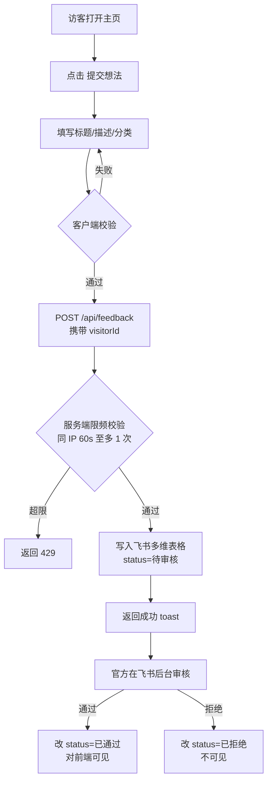
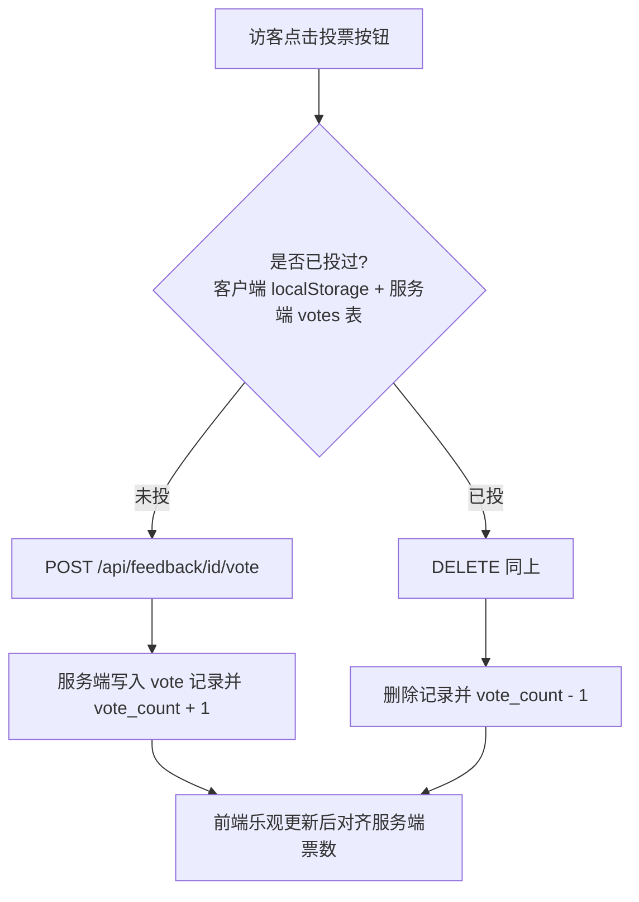
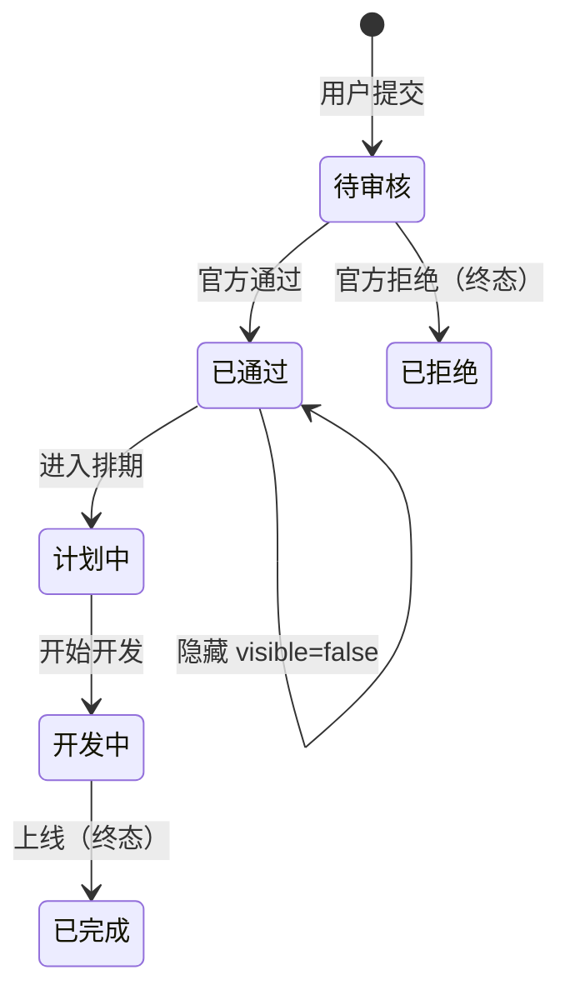

# LuxReal反馈征集平台 · 产品需求文档（PRD）

> 版本：v1.1 · MVP（与当前实现对齐）
> 编写日期：2026-04-29 · **实现同步：2026-05-03**
> 适用产品：LuxReal 专业版（LuxReal Pro）官网 · 用户反馈征集模块

**v1.1 说明**：下文 **「已实现」** 均指向仓库内 Next.js App Router 代码（`app/`、`components/`、`lib/`）；若与早期业务设想不一致，**以本节为准**作为产品/验收基线。

---

## 1. 项目背景与目标

### 1.1 背景

LuxReal 专业版网站近期上线，需要一个轻量入口收集真实用户的需求与建议。当前缺乏标准化通道，用户反馈散落在客服、社群、邮件之中，导致：

- 需求池无沉淀，重复需求难识别
- 用户无法看到他人提过同样需求 → 反复提
- 官方决策不透明 → 用户不知道何时采纳
- 没有数据支撑产品迭代优先级

### 1.2 目标

搭建一个 **公开、轻量、免登录** 的需求征集平台：

1. **降低参与门槛**：任何访客无需注册、登录即可提交想法和投票
2. **公开透明**：所有审核通过的想法对所有人可见，按热度/时间排序
3. **决策可视**：通过状态徽章（计划中 / 开发中 / 已完成）让用户看到产品落地进度
4. **官方可控**：运营人员通过飞书多维表格直接审核、改状态、隐藏不当内容

### 1.3 非目标（MVP 不做）

- 用户登录/注册体系
- 评论/讨论区
- 多级标签体系
- 看板视图
- 富文本编辑器（图片/附件上传）
- 多语言

---

## 2. 用户角色与权限

| 角色 | 身份识别 | 权限 |
|------|---------|------|
| 访客（公众用户） | 浏览器指纹（无账号） | 浏览、搜索、过滤、提交想法、投票/取消投票 |
| 官方运营 | 飞书多维表格协作者 | 审核通过/拒绝、修改状态、隐藏/恢复、查看提交者信息 |

> 访客的"身份"由 [FingerprintJS](https://github.com/fingerprintjs/fingerprintjs) 生成的 `visitorId` + 客户端 IP 共同标识，用于：① 防止重复投票 ② 限频防刷。`visitorId` **不**作为账号体系，浏览器清理后会重新生成。

---

## 3. 核心流程

### 3.1 提交想法流程


```mermaid
flowchart TD
    A[访客打开主页] --> B[点击 提交想法]
    B --> C[填写标题/描述/分类]
    C --> D{客户端校验}
    D -->|失败| C
    D -->|通过| E[POST /api/feedback<br/>携带 visitorId]
    E --> F{服务端限频校验<br/>同 IP 60s 至多 1 次}
    F -->|超限| G[返回 429]
    F -->|通过| H[写入飞书多维表格<br/>status=待审核]
    H --> I[返回成功 toast]
    I --> J[官方在飞书后台审核]
    J -->|通过| K[改 status=已通过<br/>对前端可见]
    J -->|拒绝| L[改 status=已拒绝<br/>不可见]
```

### 3.2 投票流程（已实现）


```mermaid
flowchart TD
    A[访客点击投票按钮] --> B{是否已投过?<br/>客户端 localStorage + 服务端 votes 表}
    B -->|未投| C[POST /api/feedback/id/vote]
    B -->|已投| D[DELETE 同上]
    C --> E[服务端写入 vote 记录并 vote_count + 1]
    D --> F[删除记录并 vote_count - 1]
    E --> G[前端乐观更新后对齐服务端票数]
    F --> G
```

**幂等行为（已实现）**：若同一 `visitorId` 重复 `POST` 而已存在投票记录，服务端 **不会报错**，返回当前 `vote_count` 与 `voted: true`（与「409 ALREADY_VOTED」式硬错误不同）。`DELETE` 在未投票时同理返回当前状态。

### 3.3 状态机


```mermaid
stateDiagram-v2
    [*] --> 待审核 : 用户提交
    待审核 --> 已通过 : 官方通过
    待审核 --> 已拒绝 : 官方拒绝（终态）
    已通过 --> 计划中 : 进入排期
    计划中 --> 开发中 : 开始开发
    开发中 --> 已完成 : 上线（终态）
    已通过 --> 已通过 : 隐藏 visible=false
```

**前端可见规则（已实现，分场景）**

| 场景 | 规则 |
|------|------|
| **想法广场**（`/`） | `visible=true` 且 `status ∈ {已通过, 计划中, 开发中}`。**不含「已完成」**——已完成仅在成就墙展示，避免与进行中的需求混排。 |
| **想法详情**（`/items/[id]`） | `visible=true` 且 `status ∈ {已通过, 计划中, 开发中, 已完成}`。直链不会因「已完成」单独下架而 404。 |
| **成就墙**（`/delivered`） | `visible=true` 且 `status=已完成`。排序用 `completed_at`；若运营未填 `completed_at`，**实现上以 `updated_at` 兜底**参与排序与展示文案时间。 |

---

## 4. 数据模型（飞书多维表格）

### 4.1 主表 `feedback_items`

| 字段 | 飞书字段类型 | 是否必填 | 说明 |
|------|-------------|---------|------|
| `id` | 自动编号 / 唯一 ID | 自动 | 主键 |
| `title` | 单行文本 | 是 | 标题，≤ 60 字 |
| `content` | 多行文本 | 是 | 描述，≤ 2000 字 |
| `category` | 单选 | 是 | 想法和建议 / Bug 反馈 / 其他 |
| `status` | 单选 | 是 | 待审核 / 已通过 / 计划中 / 开发中 / 已完成 / 已拒绝 |
| `visible` | 复选框 | 是 | 默认 true；false 时前端不展示 |
| `vote_count` | 数字 | 是 | 默认 0；写入投票时通过 API 累加 |
| `submitter_name` | 单行文本 | 否 | 提交者昵称（可选） |
| `submitter_contact` | 单行文本 | 否 | 提交者联系方式（可选，仅官方可见） |
| `submitter_fingerprint` | 单行文本 | 是 | FingerprintJS visitorId（仅服务端写入） |
| `submitter_ip` | 单行文本 | 是 | 客户端 IP（仅服务端写入） |
| `completed_at` | 日期 | 否 | 运营改 `status=已完成` 时手动填；空时不在成就墙展示 |
| `created_at` | 创建时间 | 自动 | 飞书自动维护 |
| `updated_at` | 最后修改时间 | 自动 | 飞书自动维护 |

### 4.2 辅表 `votes`

| 字段 | 类型 | 说明 |
|------|------|------|
| `id` | 自动编号 | 主键 |
| `item_id` | 单行文本 | 关联 `feedback_items.id` |
| `voter_fingerprint` | 单行文本 | 投票者 visitorId |
| `voter_ip` | 单行文本 | 投票者 IP |
| `created_at` | 创建时间 | 自动 |

**业务唯一约束**：`(item_id, voter_fingerprint)` 唯一。由服务端写入前先 SEARCH 校验实现（飞书多维表格无原生唯一索引）。

### 4.3 状态选项颜色映射（前端展示）

| status | 徽章颜色（建议） |
|--------|----------------|
| 已通过 | 灰 / Neutral |
| 计划中 | 蓝 / Blue |
| 开发中 | 黄 / Amber |
| 已完成 | 绿 / Green |

---

## 5. 功能清单

### 5.1 列表页（首页 `/`）（已实现）

- **渲染方式**：根页面为 **客户端列表**（`HomeClient` + **SWR** 请求 `GET /api/feedback`），首屏列表数据在浏览器拉取；骨架屏加载态、失败可重试。
- **Hero**：支持背景图 slot（当前为 `/assets/hero-banner.png`）；标题/副文案可配置；**不嵌入**时展示完整 Hero。
- **搜索**：Hero 内搜索框，**约 300ms debounce** 后驱动列表过滤，匹配 `title` + `content` 子串（不区分大小写）。
- **排序**（与 API 一致）：
  - **Trending（默认）**：`vote_count desc`，平手按 `created_at desc`
  - **Latest**：`created_at desc`
- **筛选**：类别、状态均为 Radix **Select**；状态选项仅为 **已通过 / 计划中 / 开发中**（不含「已完成」，与广场数据集一致）。
- **想法卡片**：左侧 `VoteButton`，右侧 `Link` 至详情；展示状态徽章、类别 Pill、相对提交时间。
- **分页**：API 支持 `page` / `pageSize`（默认 20），飞书侧在服务端 **聚合全表后在内存筛选排序分页**（MVP 数据量假设可接受）。**当前首页未接翻页/「加载更多」UI**，仅展示**第一页**结果（≤20 条）。若条数超过 20，需后续产品迭代补控件或提高默认 `pageSize`。
- **提交入口**：Header CTA、Hero 区域逻辑、**滚动离开 Hero 可视区后**右下角 **浮动「提交想法」按钮**（`ScrollSubmitFab`）。
- **深链**：`/?submit=1` 打开提交弹窗（便于主站外链），见 [EMBEDDING.md](./EMBEDDING.md)。

### 5.2 详情页（`/items/[id]`）（已实现）

- **渲染**：服务端 `getItem` + `dynamic = force-dynamic`，`revalidate = 30`；不可见或状态不在公开集合则 `notFound`。
- 面包屑：首页 / 想法详情
- 大号 **VoteButton**、**StatusBadge**、类别、相对时间、可选展示提交者昵称
- 完整描述（`whitespace-pre-wrap`）
- **复制链接**按钮（`CopyLinkButton`）+ 返回列表

### 5.3 提交表单（弹窗）

| 字段 | 类型 | 校验 |
|------|------|------|
| 标题 | input | 必填，1–60 字 |
| 描述 | textarea | 必填，10–2000 字 |
| 类别 | select | 必选 |
| 昵称 | input | 可选，≤ 20 字 |
| 联系方式 | input | 可选，≤ 50 字（邮箱/手机/微信） |

提交按钮：客户端校验通过后调用 API；显示 loading 与成功/失败 toast。

### 5.4 投票交互（已实现）

- `POST` / `DELETE`：`/api/feedback/[id]/vote`，Body：`{ fingerprint }`（来自 FingerprintJS `visitorId`）
- **Origin 校验**：与提交一致，依赖 `ALLOWED_ORIGINS`（未配置时不拒绝）
- 前端 **乐观更新**，失败则回滚票数与 `localStorage`
- **本地持久化**：`localStorage` 键名 `luxreal-feedback-voted`，值为已投票 `itemId` 的 JSON 数组；指纹缓存键 `luxreal-feedback-fp`

### 5.5 已上线成就墙（`/delivered`）（已实现）

独立路径 `/delivered`，展示「已完成」想法：

- 视觉：银紫渐变 Hero + `BreathingHalo` 等（**非**文档初稿的 emerald/teal；以 `globals.css` Token 为准）
- 文案：有数据时为「感谢社区，已交付 N 个想法」；统计条为 **已上线 / 总投票 / 最近交付（相对时间）**
- **列表数据**：服务端 `listDeliveredItems`，首屏 **`pageSize=100`**（单页最多展示 100 条；超出需后续分页）
- **排序**：`已完成` 集合按 **有效交付时间**降序：`completed_at` 有效则用其，否则 **`updated_at` 兜底**（运营未填 `completed_at` 仍可上墙）
- 卡片：`Link` 整块可点进详情；**无投票按钮**，仅展示票数
- **详情页投票**：成就墙卡片不投票，但 **`/items/[id]` 对「已完成」仍展示 VoteButton**，用户仍可投票/取消（若产品需「已完成禁止投票」，需在组件层按 `status` 关闭，**当前未做**）
- Header：「已上线」旁展示交付数量（来自 **SWR 轮询** `/api/stats/delivered`，`refreshInterval` 60s）；与初稿「绿色徽章」不完全一致，以现 UI 为准
- **与广场互斥**：首页列表 **不包含** `已完成`（见 §3.3）

---

## 6. 非功能需求

### 6.1 防刷与限频（已实现）

| 维度 | 限制 | 说明 |
|------|------|------|
| 提交想法 | 同 IP **60s 内至多 1 次** | `submitLimiter` |
| 投票 | 同 IP **60s 内至多 10 次** | `voteLimiter` |
| 读接口（列表/详情/统计） | 同 IP **1s 内至多 20 次** | `readLimiter` |

实现：**Upstash Redis** 滑动窗口（前缀 `feedback:rl`）；未配置 Redis 时 **进程内存兜底**（多实例部署不准确，仅适合本地）。

**未实现（与早期 PRD 差异）**：「同 visitorId 24h 内至多 5 次提交」**不在**当前代码路径中。

### 6.2 性能与数据路径（已实现）

- **列表页**：浏览器 **SWR** 拉取 API；`GET /api/feedback` 响应带 `Cache-Control: s-maxage=30, stale-while-revalidate=60`（边缘/代理可短时缓存，浏览器仍以客户端请求为主）。
- **飞书数据**：`listItems` / `listDeliveredItems` 通过 **多次分页拉取主表**，在 **Node 内存**中完成筛选、排序与分页（记录数极大时需迭代为服务端过滤或裁剪）。
- **tenant_access_token**：**进程内存缓存**，到期前 **5 分钟**刷新；**无**独立 KV 第二层缓存。
- **详情页**：`force-dynamic`，每次请求服务端读飞书；`revalidate=30` 为配置项，**未使用** `generateStaticParams` 静态生成全部详情。

### 6.3 安全（已实现）

- 飞书密钥仅存环境变量
- 写操作经 Next Route Handlers
- **POST/DELETE 投票与 POST 提交**：校验 `Origin` ∈ `ALLOWED_ORIGINS`；**若环境变量未配置或为空列表，则不做来源限制**（`origin` 缺失的同源请求放行）
- `submitter_ip` / `submitter_fingerprint` 不在 API 响应体中返回给前端

### 6.4 可用性（已实现）

- 移动端优先；viewport **允许用户缩放至 5×**（`maximumScale=5`）
- **嵌入**：`?embed=1` 由 `layout` 内联脚本为 `body` 加 `.embed`，`globals.css` 隐藏 `[data-embed-hide]`（Header、Hero）；背景透明。详见 [EMBEDDING.md](./EMBEDDING.md)
- **postMessage 高度自适应**：文档中为可选方案，**默认未在 layout 启用**

### 6.5 可观测性

- Vercel Analytics 接入页面访问量
- 关键 API 错误上报（控制台 `console.error` + Vercel Logs）
- 提交/投票动作打点（后续可接入更专业的埋点平台）

---

## 7. API 设计（Next.js Route Handlers）

所有接口返回 JSON：`{ ok: boolean, data?: T, error?: { code, message } }`。

**查询参数约定**：`category`、`status` 的取值与飞书/前端一致，为 **中文文案**（如 `想法和建议`、`已通过`），**不是** `ideas|bug|other` 英文别名。

### 7.1 列表

```
GET /api/feedback
  ?sort=trending|latest        默认 trending
  &category=想法和建议|Bug 反馈|其他    可省略
  &status=已通过|计划中|开发中           可省略（仅广场三态）
  &q=关键词                    可省略
  &page=1&pageSize=20
```

返回：`{ ok: true, data: { items: FeedbackItem[], total: number, page, pageSize } }`

### 7.2 详情

```
GET /api/feedback/[id]
```

返回单条 `FeedbackItem`。

### 7.3 提交

```
POST /api/feedback
Body: { title, content, category, submitter_name?, submitter_contact?, fingerprint }
Header: 服务端读取 X-Forwarded-For 拿到 IP
```

返回：`{ ok: true, data: { id } }`，HTTP **201 Created**；校验失败 `400`、限频 `429`、来源不允许 `403`。

### 7.4 投票

```
POST   /api/feedback/[id]/vote      Body: { fingerprint }
DELETE /api/feedback/[id]/vote      Body: { fingerprint }
```

返回：`{ ok: true, data: { vote_count, voted: boolean } }`。

### 7.5 已上线列表

```
GET /api/feedback/delivered?page=1&pageSize=20
```

服务端 `pageSize` 上限 **100**。成就墙页面当前请求 **pageSize=100**；默认 API 示例仍为 20。

返回：`{ ok: true, data: { items: FeedbackItem[], total, page, pageSize, stats: { total, totalVotes, lastDeliveredAt } } }`。

### 7.6 已上线统计（轻量）

```
GET /api/stats/delivered
```

返回：`{ ok: true, data: { total, totalVotes, lastDeliveredAt } }`。供 Header 等使用；响应 `Cache-Control: s-maxage=60, stale-while-revalidate=120`。

### 7.7 错误码

| code | HTTP | 说明 |
|------|------|------|
| `INVALID_PARAMS` | 400 | 参数校验失败 |
| `FORBIDDEN` | 403 | `Origin` 不在 `ALLOWED_ORIGINS`（提交/投票） |
| `RATE_LIMITED` | 429 | 触发限频 |
| `NOT_FOUND` | 404 | 资源不存在 |
| `ALREADY_VOTED` | 409 | （预留）当前实现对重复 POST 为幂等成功，一般不返回此项 |
| `NOT_VOTED` | 409 | （预留）同上 |
| `FEISHU_ERROR` | 502 | 飞书接口异常 |
| `INTERNAL` | 500 | 其他服务器错误 |

---

## 8. 前端 UI 规范（已实现 · Token 摘要）

设计以 **`app/globals.css` CSS 变量** 为唯一色源，**Tailwind** 扩展引用 `rgb(var(--token) / <alpha>)`。组件层避免硬编码色值。

| 项 | 值（摘要） |
|----|------------|
| CTA | `--cta` 黑底、`--cta-fg` 白字 |
| 表面/文字 | `--surface*`、`--ink*` 层级 |
| 装饰强调 | `--accent-silver`、`--accent-violet`、`--accent-glow`（银紫光晕） |
| 圆角/阴影 | 卡片 `rounded-2xl`～`3xl`、`shadow-card` / `shadow-card-hover`（见 `tailwind.config`） |
| 图标/插图 | 首页 Hero 可用 `/assets/hero-banner.png` 等静态资源 |

字体：系统无衬线栈（`font-sans`），中文回退由系统字体承担。

---

## 9. 部署与运营

### 9.1 部署

- 仓库：GitHub
- 平台：Vercel（推荐）/ Cloudflare Pages
- 域名：`feedback.luxreal.com`（待你绑定 DNS）
- 环境变量：见下表

| 变量 | 说明 |
|------|------|
| `FEISHU_APP_ID` | 企业自建应用 ID |
| `FEISHU_APP_SECRET` | 企业自建应用密钥 |
| `FEISHU_APP_TOKEN` | 多维表格 app_token（URL 解析得到） |
| `FEISHU_TABLE_ITEMS` | feedback_items 的 table_id |
| `FEISHU_TABLE_VOTES` | votes 的 table_id |
| `UPSTASH_REDIS_REST_URL` | Upstash Redis URL |
| `UPSTASH_REDIS_REST_TOKEN` | Upstash Redis Token |
| `ALLOWED_ORIGINS` | 逗号分隔允许的 Origin（主站 + feedback 子域） |

### 9.2 主站嵌入方案

以 [EMBEDDING.md](./EMBEDDING.md) 为准：**链接跳转（推荐）**、`?submit=1` 自动开弹窗、**iframe + `?embed=1`** 隐藏 Header/Hero、可选 `postMessage` 高度、**ALLOWED_ORIGINS** 需包含主站以免 403。

### 9.3 运营 SOP

1. 飞书多维表格设置 "待审核" 视图，新提交进来后由运营每日检查
2. 通过的：将 `status` 改为 `已通过`，必要时打类别
3. 不当内容：取消 `visible` 复选框，立即从前端消失（不删除，留痕）
4. 每周根据 `vote_count` 排序产出 Top 10 需求清单，纳入产品迭代讨论

---

## 10. 里程碑

| 阶段 | 输出 | 工时估计 |
|------|------|---------|
| 阶段 1 | 本 PRD 定稿 | 0.5 天 |
| 阶段 2 | UI 视觉稿 / Token | 0.5 天 |
| 阶段 3 | 前后端开发完成（含飞书联调） | 2–3 天 |
| 阶段 4 | 部署上线 + 主站嵌入 | 0.5 天 |
| **阶段 5（v1.1）** | PRD 与实现对齐、成就墙与数据策略迭代 | 按需 |

以上工时为原计划估算；**当前仓库已具备可运行 MVP**。

---

## 11. 验收标准（与 v1.1 实现对齐）

- [x] 访客可在不登录情况下提交想法，成功后弹窗提示并可自动关闭
- [x] 同 IP 60s 内重复提交被拦截（429）
- [x] 官方在飞书改 `status` / `visible` 后，刷新或重新请求可见；列表无强 ISR，以实际请求与飞书为准
- [x] 取消 `visible` 后列表与详情均不可见（详情 404）
- [x] 投票乐观更新，失败回滚；刷新后投票状态由 localStorage 恢复
- [x] 同一 visitorId 对同一项目重复 POST 不会多计票（幂等）
- [x] Trending / Latest 排序符合规则
- [x] 搜索 / 类别 / 状态过滤生效（广场不含已完成）
- [x] 成就墙仅展示已完成；`completed_at` 空时仍可展示（时间兜底）
- [x] `/delivered` 首屏至多 100 条；首页首屏至多 20 条且无翻页 UI（已知限制）
- [x] `?embed=1` 隐藏 Header/Hero；`?submit=1` 打开提交弹窗
- [ ] （可选）Vercel Analytics / 专业埋点按运营需要补全
